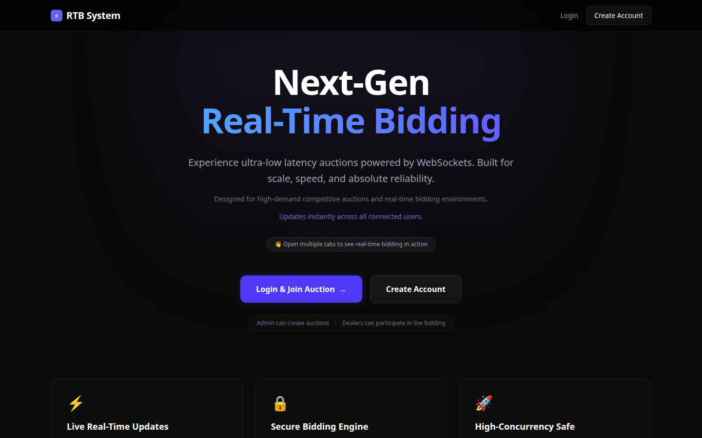
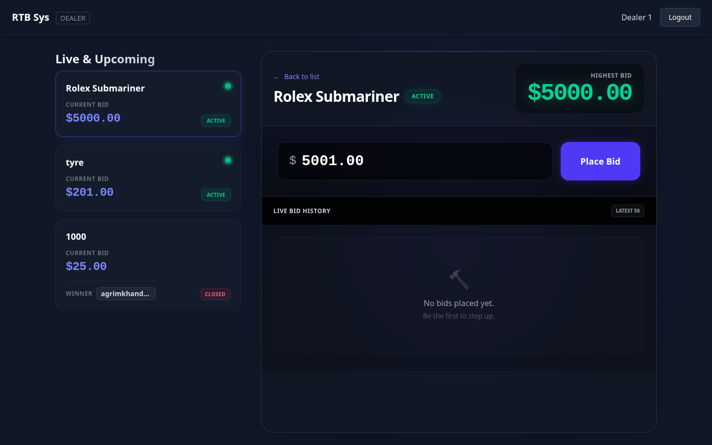
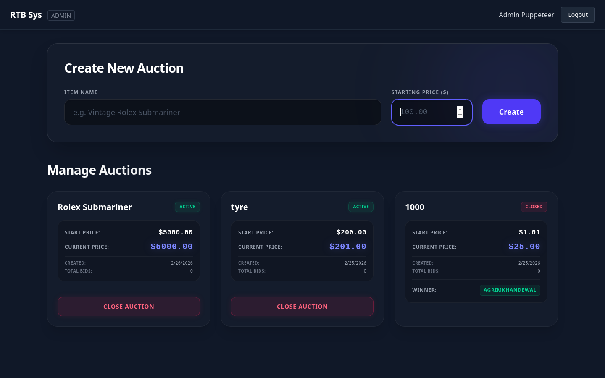
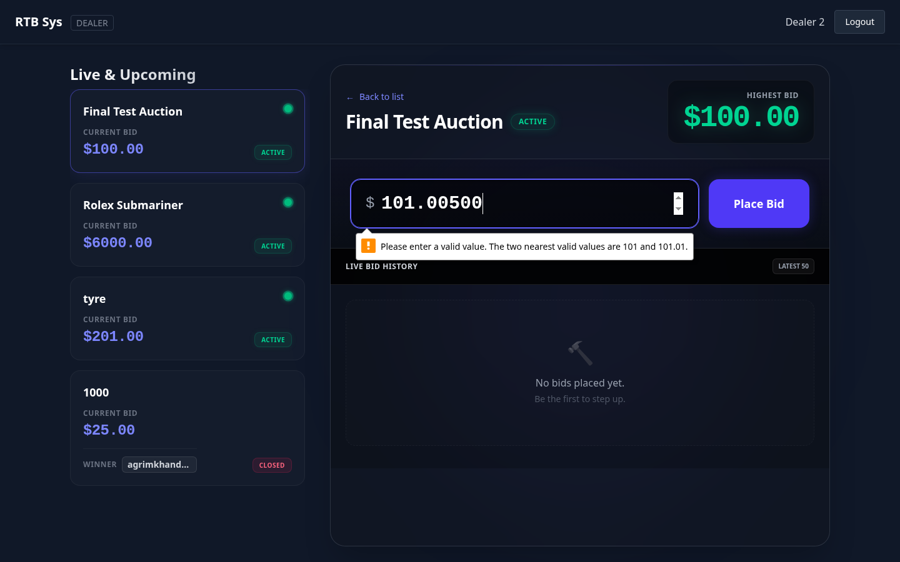

# Real-Time Bidding System (RTB)


A robust, ultra-low latency, full-stack real-time bidding application. Engineered with modern web technologies, this platform delivers synchronous auction updates across all connected clients via WebSockets, ensuring absolute reliability and consistency during high-volume bidding.

---

## 🌐 Live Demo

🚀 **Production App:** [Live on Vercel](https://rtb-system-58olqpkwa-agrims-projects-fd95ab4c.vercel.app/)

---

## 🚀 Key Features

- **Live Real-Time Bidding**: WebSockets power instant sub-second bid updates without page refreshes.
- **Secure Authentication**: Role-based access control leveraging JWT (Admin vs Dealer views).
- **Interactive Dashboards**: Tailored views allowing Admins to manage/monitor auctions and Dealers to bid dynamically.
- **Race-Condition Safe**: Bulletproof backend architecture ensures accurate bid processing during high concurrency.
- **Modern Premium UI/UX**: Responsive, accessible, dark-themed glassmorphic interface built with React & Tailwind CSS.

---

## 🧠 System Architecture

The platform follows a containerized full-stack architecture:

- React frontend communicates with backend via REST APIs and WebSockets
- Express backend handles authentication, auctions, and bid processing
- Socket.IO ensures real-time synchronization across clients
- PostgreSQL stores persistent auction and user data
- Docker Compose orchestrates all services for reproducible environments

---

## 🛠️ Tech Stack

**Frontend:**
- React (Vite)
- Tailwind CSS v4
- React Router DOM
- Socket.IO Client

**Backend:**
- Node.js & Express.js
- Socket.IO (WebSockets)
- JWT (JSON Web Tokens)
- bcryptjs (Password Hashing)

**Database & Infrastructure:**
- PostgreSQL (Primary Data Store)
- Docker & Docker Compose (Containerization)

---

## 📂 Folder Structure

```
rtb-system/
├── backend/
│   ├── src/
│   │   ├── config/          # DB & Server configuration
│   │   ├── controllers/     # Route logic (Auth, Auctions)
│   │   ├── middlewares/     # JWT Role Verification
│   │   ├── routes/          # API endpoint declarations
│   │   ├── scripts/         # DB Seeding scripts
│   │   ├── index.js         # Express App Entry Point
│   │   └── socket.js        # WebSocket Event Handlers
│   ├── package.json
│   └── Dockerfile
├── frontend/
│   ├── src/
│   │   ├── components/      # Reusable UI elements (Navbar, Modals, etc)
│   │   ├── context/         # React Context (Auth, Socket)
│   │   ├── pages/           # Route views (Landing, Admin Dashboard, etc)
│   │   ├── utils/           # Helper functions & API interceptors
│   │   ├── App.jsx          # Route configuration
│   │   ├── index.css        # Global Tailwind styles
│   │   └── main.jsx         # React Entry Point
│   ├── package.json
│   ├── vite.config.js
│   └── Dockerfile
├── postgres-init/           # Database initialization SQL scripts
├── screenshots/             # Application visual demonstrations
├── docker-compose.yml       # Orchestrates all architectural services
├── .env.example             # Template for Environment Variables
└── README.md                # Project Documentation
```

---

## ⚙️ Prerequisites

- **Docker Desktop** (or Docker engine + Docker Compose) installed on your system.
- *Node.js* (Only required if running outside of Docker)

---

## 🏃 Locally Running the App (Dockerized)

The absolute quickest way to bring up the full stack is via Docker Compose.

**Step 1. Clone & prepare environment**
```bash
git clone <your-repository-url>
cd rtb-system
cp .env.example .env
```

**Step 2. Build & run the containers**
```bash
docker-compose up --build
```
*Note: Make sure port 5173, 5002, and 5432 are free on your local machine.*

**Step 3. Access the application**
Open your browser and navigate to: [http://localhost:5173](http://localhost:5173)

---

## 🗄️ Database Seeding & Test Accounts

Upon `docker-compose up`, the initialization scripts located in `postgres-init/` automatically scaffold the schemas. 

To populate test data, a seed script is provided.

**Step 1. Run the seeder against the running container**
```bash
docker-compose exec backend npm run seed
```

### Generated Test Accounts

| Role | Email | Password |
| :--- | :--- | :--- |
| **Admin** | admin@example.com | password123 |
| **Dealer 1**| test@example.com | password123 |
| **Dealer 2**| dealer2@example.com | password123 |

*(Feel free to register new accounts directly from the `/signup` page as well).*

---

## 🧪 Testing Real-Time Bidding

1. Identify or create a new auction as an **Admin** (`admin@example.com`). Ensure you click "Start Auction" to make it active.
2. Open **two or more separate Incognito windows/browsers**.
3. Log in as a different Dealer in each window (`test@example.com`, `dealer2@example.com`, or standard newly signed up users).
4. Navigate to the Dealer Dashboard, click the active auction, and rapidly place simulated out-bids.
5. Watch the bid history, current price, and timestamps update simultaneously globally across all tabs exactly when a transaction succeeds.
6. As the Admin, click **Close Auction**. Observe the closing modal verification flow, followed by the immediate calculation and notification of the Winner/Loser dashboards delivered simultaneously to dealers.

---

## 🔌 API Overview

### Authentication `api/auth`
- `POST /register`: Create a new Admin or Dealer account.
- `POST /login`: Generate a JWT token.
- `GET /me`: Return current authenticated profile.

### Auctions `api/auctions`
- `GET /`: Retrieve all auctions.
- `POST /`: Initialize a new auction *(Admin Only)*.
- `POST /:id/start`: Change an auction status from INACTIVE to ACTIVE *(Admin Only)*.
- `POST /:id/close`: Change an auction status from ACTIVE to CLOSED and distribute closed payload over websocket *(Admin Only)*.

### Bidding `api/bids`
- `POST /:auctionId`: Submit a new bid against a specific active auction *(Dealer Only)*. Ensures validations over `current_price` and logs historical transactions. 

---

## 🐳 Docker Services Architecture

The application defines three interconnected containers within `docker-compose.yml`:
- **`postgres`**: The relational database image housing persistent volumes and initialization layers.
- **`backend`**: Node Express application. Wait-for-it methodology ensures the database accepts connections prior to execution. Mounts the local port to allow REST API functionality and WebSocket upgrades.
- **`frontend`**: Vite-based React container leveraging hot-module replacement and mounting against port 5173 on the host network.

---

## 📷 Screenshots

*A look at the platform in action.*

| Home Page | Dealer Dashboard |
| :---: | :---: |
|  |  |

| Admin Dashboard | Auction Results (Win/Loss) |
| :---: | :---: |
|  |   |

---

## 📝 License

Developed as an advanced full-stack assignment. Open for review purposes. 

---

## 👨💻 Author

**Agrim Khandelwal**

- B.Tech Computer Science Student
- Full-Stack Developer (MERN + PostgreSQL)
- Focus: Real-Time Systems & Scalable Web Applications

📧 Email: agrimkhandelwal11@gmail.com  
🔗 GitHub Repo: [Agrimkhandelwal/rtb-system](https://github.com/Agrimkhandelwal/rtb-system)

---

## 🚀 Future Enhancements

- Auction timers & synchronized countdowns
- Payment integration for winning bids
- Horizontal scaling using Redis Pub/Sub
- Cloud deployment (AWS / GCP)
- Audit logs & analytics dashboard
